# SpendLens Application State Machine

## Overview
This document describes the complete state machine for the SpendLens application, including user authentication states, data states, and UI navigation flows.

---

## State Machine Diagram

```mermaid
stateDiagram-v2
    [*] --> Guest

    Guest --> Authenticating: Click Login/Signup

    Authenticating --> LoggedOut: Auth Failed
    Authenticating --> LoggedIn: Auth Success

    LoggedOut --> Guest: Return to Landing

    LoggedIn --> Dashboard: Default Route

    state LoggedIn {
        [*] --> Dashboard

        Dashboard --> UploadPage: Navigate Upload
        Dashboard --> Statements: Navigate Statements
        Dashboard --> Transactions: Navigate Transactions
        Dashboard --> RiskAnalysis: Navigate Risks
        Dashboard --> Insights: Navigate Insights
        Dashboard --> Settings: Navigate Settings

        state UploadPage {
            [*] --> NoFiles
            NoFiles --> SelectingFiles: Browse/Drop Files
            SelectingFiles --> FilesSelected: Files Chosen
            FilesSelected --> Uploading: Click Upload
            Uploading --> Processing: Upload Complete
            Processing --> Success: Parse Success
            Processing --> Error: Parse Failed
            Success --> NoFiles: Upload Another
            Error --> NoFiles: Try Again
        }

        state Statements {
            [*] --> LoadingStatements
            LoadingStatements --> EmptyStatements: No Data
            LoadingStatements --> ViewingStatements: Has Data
            ViewingStatements --> DeletingStatement: Click Delete
            DeletingStatement --> ViewingStatements: Confirm Delete
            ViewingStatements --> TransactionView: Click View Transactions
        }

        state Transactions {
            [*] --> LoadingTransactions
            LoadingTransactions --> EmptyTransactions: No Data
            LoadingTransactions --> ViewingTransactions: Has Data
            ViewingTransactions --> FilteringTransactions: Apply Filters
            FilteringTransactions --> ViewingTransactions: Show Results
            ViewingTransactions --> EditingTransaction: Click Edit
            EditingTransaction --> ViewingTransactions: Save Changes
            ViewingTransactions --> EnhancingWithAI: Click Enhance
            EnhancingWithAI --> ViewingTransactions: Enhancement Complete
        }

        state RiskAnalysis {
            [*] --> LoadingPatterns
            LoadingPatterns --> EmptyPatterns: No Patterns
            LoadingPatterns --> ViewingPatterns: Has Patterns
            EmptyPatterns --> Analyzing: Click Analyze
            ViewingPatterns --> Analyzing: Click Re-analyze
            Analyzing --> ViewingPatterns: Analysis Complete
            ViewingPatterns --> EditingPattern: Click Edit
            ViewingPatterns --> ProvidingFeedback: Click Feedback
            EditingPattern --> ViewingPatterns: Save Changes
            ProvidingFeedback --> ViewingPatterns: Submit Feedback
            ViewingPatterns --> DismissingPattern: Click Dismiss
            DismissingPattern --> ViewingPatterns: Confirm Dismiss
        }

        state Insights {
            [*] --> LoadingInsights
            LoadingInsights --> EmptyInsights: No Data
            LoadingInsights --> ViewingInsights: Has Data
            ViewingInsights --> FilteringByCategory: Select Category
            FilteringByCategory --> ViewingInsights: Show Filtered
        }

        state Settings {
            [*] --> ViewingSettings
            ViewingSettings --> EditingProfile: Click Edit Profile
            ViewingSettings --> ChangingPassword: Click Change Password
            ViewingSettings --> EditingPreferences: Change Settings
            EditingProfile --> ViewingSettings: Save Profile
            ChangingPassword --> ViewingSettings: Save Password
            EditingPreferences --> ViewingSettings: Save Preferences
        }

        Dashboard --> LoggedOut: Logout
        Statements --> LoggedOut: Logout
        Transactions --> LoggedOut: Logout
        RiskAnalysis --> LoggedOut: Logout
        Insights --> LoggedOut: Logout
        Settings --> LoggedOut: Logout
    }

    LoggedOut --> [*]: Session Ends
```



---

## Detailed State Descriptions

### 1. Authentication States

#### Guest (Unauthenticated)
**Description:** User is not logged in, viewing public pages

**Available Actions:**
- Navigate to Login page
- Navigate to Signup page

**Data Access:** None

**Routes:**
- `/login`
- `/signup`

**Transitions:**
- → `Authenticating` when user submits credentials
- → `[*]` when user closes browser

---

#### Authenticating
**Description:** Processing login/signup request

**Substates:**
- `Validating` - Checking form inputs
- `Submitting` - Sending request to server
- `Verifying` - Server validating credentials

**Actions:**
- Display loading spinner
- Disable form inputs

**Transitions:**
- → `LoggedIn` if credentials valid + JWT received
- → `LoggedOut` if credentials invalid or error

**Error Cases:**
- Invalid email format
- Wrong password
- Email already exists (signup)
- Network error

---

#### LoggedOut (Failed Auth)
**Description:** Authentication failed, showing error

**Available Actions:**
- Retry login/signup
- Navigate between login and signup
- View error message

**Transitions:**
- → `Guest` when user dismisses error
- → `Authenticating` when retry

---

#### LoggedIn
**Description:** User authenticated with valid JWT token

**Stored Data:**
- JWT token (localStorage)
- User object (email, name, id)
- Auth headers (axios defaults)

**Available Routes:**
- All protected routes accessible
- Can navigate between all app pages

**Session Management:**
- Token expires after 7 days
- Auto-logout on 401 errors
- Token refresh on activity

**Transitions:**
- → `LoggedOut` on manual logout
- → `LoggedOut` on token expiration
- → Various page states within app

---

### 2. Dashboard State

#### Dashboard (Home)
**Description:** Main landing page after login

**Displayed Information:**
- Quick stats cards (statements, transactions, risk patterns)
- Recent activity
- Call-to-action buttons

**Available Actions:**
- Navigate to any app section
- Quick upload shortcut
- View statistics

**Data Loading:**
- Async load: statements count
- Async load: transactions count
- Async load: risk patterns count

**Transitions:**
- → `UploadPage` - Click "Upload Statement"
- → `Statements` - Click "View Statements"
- → `Transactions` - Click "View Transactions"
- → `RiskAnalysis` - Click "Analyze Risks"
- → `Insights` - Click "View Insights"
- → `Settings` - Click profile/settings icon

---

### 3. Upload Page States

#### NoFiles
**Description:** Initial state, no files selected

**UI Elements:**
- Drag-and-drop zone
- Browse button
- Supported formats info

**Available Actions:**
- Drag files over zone
- Click browse to select files

**Transitions:**
- → `SelectingFiles` when user interacts with file picker

---

#### SelectingFiles
**Description:** File picker open or drag active

**Available Actions:**
- Select one or multiple files
- Cancel selection

**Transitions:**
- → `FilesSelected` when files chosen
- → `NoFiles` if cancelled

---

#### FilesSelected
**Description:** Files selected, ready to upload

**Displayed Information:**
- List of selected files
- File names and sizes
- File type validation results

**Available Actions:**
- Remove individual files
- Upload all files
- Add more files

**Validations:**
- Check file types (PDF, CSV, images)
- Check file sizes (max 50MB)
- Check file count

**Transitions:**
- → `Uploading` when user clicks upload
- → `NoFiles` if all files removed

---

#### Uploading
**Description:** Files being uploaded to server

**Progress Tracking:**
- Upload progress bar (0-100%)
- Current file being uploaded
- Files uploaded / total files

**UI State:**
- Show progress indicator
- Disable cancel during upload
- Show estimated time

**Transitions:**
- → `Processing` when upload complete
- → `Error` if upload fails

**Error Cases:**
- Network timeout
- Server error
- File too large
- Invalid file type

---

#### Processing
**Description:** Server parsing uploaded statements

**Background Operations:**
- AI Vision extraction (GPT-4o)
- Transaction categorization
- Database insertion

**UI State:**
- Show processing animation
- Display status messages
- Show transaction count as extracted

**Transitions:**
- → `Success` when all files processed
- → `Error` if parsing fails

**Substates:**
- `Extracting` - Vision API reading file
- `Categorizing` - AI categorizing transactions
- `Saving` - Storing in database

---

#### Success
**Description:** Upload and processing complete

**Displayed Information:**
- Success message
- Number of statements uploaded
- Number of transactions extracted
- Processing time

**Available Actions:**
- Upload another statement
- View uploaded statements
- View transactions
- Analyze risks

**Auto-Actions:**
- Refresh dashboard statistics
- Update statements list

**Transitions:**
- → `NoFiles` to upload more
- → `Statements` to view
- → `Transactions` to view transactions

---

#### Error
**Description:** Upload or processing failed

**Error Types:**
- Upload failure
- Parsing failure
- Invalid file format
- Server error

**Displayed Information:**
- Error message
- Which file failed
- Suggested actions

**Available Actions:**
- Try again
- Upload different file
- Contact support

**Transitions:**
- → `NoFiles` to retry

---

### 4. Statements Page States

#### LoadingStatements
**Description:** Fetching statements from database

**UI State:**
- Show loading spinner
- Disable interactions

**API Call:**
- `GET /api/statements?page=1&limit=20`

**Transitions:**
- → `EmptyStatements` if no data
- → `ViewingStatements` if data exists
- → Error state if fetch fails

---

#### EmptyStatements
**Description:** No statements uploaded yet

**Displayed Information:**
- Empty state illustration
- Helpful message
- Upload prompt

**Available Actions:**
- Navigate to upload page

**Transitions:**
- → `UploadPage` when click upload

---

#### ViewingStatements
**Description:** Displaying list of statements

**Displayed Information:**
- Table of statements
  - File name
  - Upload date
  - Transaction count
  - Date range
  - Actions (view, delete)
- Statistics cards
- Pagination controls

**Available Actions:**
- View statement transactions
- Delete statement
- Navigate pages
- Sort columns
- Search by filename

**Data Refresh:**
- Auto-refresh after delete
- Manual refresh button

**Transitions:**
- → `DeletingStatement` when click delete
- → `Transactions` when view transactions
- → `LoadingStatements` on refresh

---

#### DeletingStatement
**Description:** Confirming and deleting statement

**UI State:**
- Show confirmation modal
- Display warning message
- Show affected transaction count

**Available Actions:**
- Confirm deletion
- Cancel

**API Call:**
- `DELETE /api/statements/:id`

**Post-Delete:**
- Remove from list
- Update statistics
- Show success toast

**Transitions:**
- → `ViewingStatements` after delete
- → `ViewingStatements` if cancelled

---

### 5. Transactions Page States

#### LoadingTransactions
**Description:** Fetching transactions from database

**Query Parameters:**
- Page number
- Page size
- Search term
- Category filter
- Date range

**API Call:**
- `GET /api/transactions?search=&category=&page=1&limit=50`

**Transitions:**
- → `EmptyTransactions` if no data
- → `ViewingTransactions` if data exists

---

#### EmptyTransactions
**Description:** No transactions available

**Displayed Information:**
- Empty state
- Upload prompt

**Available Actions:**
- Navigate to upload

**Transitions:**
- → `UploadPage` when click upload

---

#### ViewingTransactions
**Description:** Displaying transactions table

**Displayed Information:**
- Transaction table
  - Date
  - Description
  - Category
  - Amount In/Out
  - Balance
  - Actions
- Filter controls
- Search bar
- Pagination

**Available Actions:**
- Search transactions
- Filter by category
- Filter by date range
- Sort columns
- Edit transaction
- Enhance with AI
- Export CSV

**Transitions:**
- → `FilteringTransactions` when apply filters
- → `EditingTransaction` when click edit
- → `EnhancingWithAI` when enhance

---

#### FilteringTransactions
**Description:** Applying filters to transaction list

**Filter Types:**
- Text search (description)
- Category dropdown
- Date range picker
- Amount range

**Processing:**
- Debounced search (500ms)
- Combined filters (AND logic)
- Reset to page 1

**API Call:**
- `GET /api/transactions?search=X&category=Y&dateFrom=Z`

**Transitions:**
- → `ViewingTransactions` with filtered results

---

#### EditingTransaction
**Description:** Editing transaction details

**UI State:**
- Side drawer opened
- Form with transaction data
- Category dropdowns

**Editable Fields:**
- Description
- Primary category
- Detailed category
- Notes

**Available Actions:**
- Save changes
- Cancel edit
- Delete transaction

**API Call:**
- `PATCH /api/transactions/:id`

**Transitions:**
- → `ViewingTransactions` after save
- → `ViewingTransactions` if cancelled

---

#### EnhancingWithAI
**Description:** Running AI enhancement on transactions

**Background Operations:**
- AI generates descriptions
- AI categorizes transactions
- Updates database

**UI State:**
- Show progress indicator
- Display status
- Show enhanced count

**API Call:**
- `POST /api/transactions/enhance`

**Transitions:**
- → `ViewingTransactions` when complete

---

### 6. Risk Analysis Page States

#### LoadingPatterns
**Description:** Fetching risk patterns from database

**API Call:**
- `GET /api/risks/patterns`

**Transitions:**
- → `EmptyPatterns` if no patterns
- → `ViewingPatterns` if patterns exist

---

#### EmptyPatterns
**Description:** No risk patterns detected yet

**Displayed Information:**
- Empty state
- Explanation of risk analysis
- Analyze button

**Available Actions:**
- Run risk analysis

**Transitions:**
- → `Analyzing` when click analyze

---

#### ViewingPatterns
**Description:** Displaying detected risk patterns

**Displayed Information:**
- Statistics cards (total, by severity)
- Pattern cards
  - Pattern icon
  - Severity badge
  - Description
  - Affected transactions
  - Amount involved
  - Confidence score
  - Recommendation
  - Actions (edit, feedback, dismiss)

**Available Actions:**
- Re-analyze risks
- Edit pattern
- Provide feedback
- Dismiss pattern
- View pattern details

**Filtering:**
- Filter by severity
- Sort by date/severity

**Transitions:**
- → `Analyzing` when re-analyze
- → `EditingPattern` when edit
- → `ProvidingFeedback` when feedback
- → `DismissingPattern` when dismiss

---

#### Analyzing
**Description:** AI analyzing transactions for risk patterns

**Background Operations:**
- Fetch all user transactions
- Run AI risk detection
- Match against templates
- Calculate confidence scores
- Save new patterns to database

**UI State:**
- Show loading overlay
- Display progress message
- Disable interactions

**API Call:**
- `POST /api/risks/analyze`

**Processing Time:**
- Depends on transaction count
- Shows estimated time
- Cancellable

**Transitions:**
- → `ViewingPatterns` when complete
- → `ViewingPatterns` if cancelled

---

#### EditingPattern
**Description:** Editing risk pattern details

**UI State:**
- Modal opened
- Form with pattern data

**Editable Fields:**
- Description
- Recommendation
- Severity level

**Available Actions:**
- Save changes
- Cancel

**API Call:**
- `PATCH /api/risks/patterns/:id`

**Transitions:**
- → `ViewingPatterns` after save

---

#### ProvidingFeedback
**Description:** Submitting feedback on pattern

**UI State:**
- Feedback modal opened
- Thumbs up/down
- Accuracy questions
- Notes field

**Feedback Fields:**
- Is accurate? (boolean)
- Is relevant? (boolean)
- Is actionable? (boolean)
- Additional notes (text)

**Available Actions:**
- Submit feedback
- Cancel

**API Call:**
- `POST /api/risks/feedback`

**Post-Submit:**
- Update pattern learning scores
- Improve future detection
- Show thank you message

**Transitions:**
- → `ViewingPatterns` after submit

---

#### DismissingPattern
**Description:** Dismissing a risk pattern

**UI State:**
- Confirmation dialog
- Warning message

**Available Actions:**
- Confirm dismiss
- Cancel

**API Call:**
- `DELETE /api/risks/patterns/:id`

**Post-Dismiss:**
- Remove from list
- Update statistics
- Pattern marked as dismissed (soft delete)

**Transitions:**
- → `ViewingPatterns` after dismiss

---

### 7. Insights Page States

#### LoadingInsights
**Description:** Generating financial insights

**API Call:**
- `GET /api/insights`

**Background Processing:**
- Calculate income vs spending
- Generate category breakdown
- Detect recurring payments
- Calculate forecasts
- Generate AI insights

**Transitions:**
- → `EmptyInsights` if no transactions
- → `ViewingInsights` if data available

---

#### EmptyInsights
**Description:** Not enough data for insights

**Displayed Information:**
- Empty state
- Minimum data requirement message
- Upload prompt

**Requirements:**
- At least 3 months of data recommended
- At least 50 transactions

**Transitions:**
- → `UploadPage` to add more data

---

#### ViewingInsights
**Description:** Displaying financial insights and charts

**Displayed Information:**
- Income vs Spending chart (line)
- Category breakdown (pie chart)
- Top spending categories (bar chart)
- Fixed vs Variable costs
- Recurring payments list
- 3-month forecast
- AI-generated insights cards

**Available Actions:**
- Filter by date range
- Filter by category
- Export insights report
- Refresh insights

**Interactive Charts:**
- Click pie chart segments for details
- Hover for tooltips
- Zoom time range

**Transitions:**
- → `FilteringByCategory` when select category
- → `Transactions` when click "View Transactions"

---

#### FilteringByCategory
**Description:** Showing insights filtered by category

**Filter Applied:**
- Single category selected
- Insights recalculated for category

**Displayed Information:**
- Category-specific spending trend
- Subcategory breakdown
- Top merchants in category
- Month-over-month comparison

**Available Actions:**
- Clear filter
- Select different category

**Transitions:**
- → `ViewingInsights` when clear filter

---

### 8. Settings Page States

#### ViewingSettings
**Description:** Displaying user settings

**Displayed Sections:**
1. **Profile**
   - Full name
   - Email (read-only)
   - Edit button

2. **Security**
   - Change password button
   - Last login date

3. **Preferences**
   - Theme (light/dark/auto)
   - Currency (USD/EUR/GBP/INR)
   - Date format
   - Notifications toggle

4. **Danger Zone**
   - Delete account button

**Available Actions:**
- Edit profile
- Change password
- Update preferences
- Delete account

**Transitions:**
- → `EditingProfile` when edit profile
- → `ChangingPassword` when change password
- → `EditingPreferences` when change settings

---

#### EditingProfile
**Description:** Editing user profile information

**UI State:**
- Profile form editable
- Save/cancel buttons

**Editable Fields:**
- Full name

**Validation:**
- Name required
- Max length

**API Call:**
- `PUT /api/auth/profile`

**Transitions:**
- → `ViewingSettings` after save

---

#### ChangingPassword
**Description:** Changing user password

**UI State:**
- Password change modal
- Three input fields

**Required Fields:**
- Current password
- New password (min 8 chars)
- Confirm password

**Validation:**
- Current password correct
- New password meets requirements
- Passwords match

**API Call:**
- `POST /api/auth/change-password`

**Security:**
- Current password verified server-side
- New password hashed with bcrypt

**Transitions:**
- → `ViewingSettings` after success
- Show error if validation fails

---

#### EditingPreferences
**Description:** Updating app preferences

**Editable Settings:**
- Theme selection
- Currency selection
- Date format selection
- Notifications toggle

**API Call:**
- `PUT /api/auth/settings`

**Auto-Save:**
- Saves on change
- Shows success toast

**Transitions:**
- → `ViewingSettings` after save

---

## State Transition Matrix

| From State | Event | To State | Conditions |
|-----------|-------|----------|------------|
| Guest | Submit login | Authenticating | Form valid |
| Guest | Submit signup | Authenticating | Form valid |
| Authenticating | Auth success | LoggedIn | Valid JWT |
| Authenticating | Auth failed | LoggedOut | Invalid credentials |
| LoggedIn | Logout | Guest | User action |
| LoggedIn | Token expired | Guest | 401 response |
| Dashboard | Click upload | UploadPage | Authenticated |
| NoFiles | Select files | FilesSelected | Files valid |
| FilesSelected | Click upload | Uploading | Files ready |
| Uploading | Upload complete | Processing | 100% uploaded |
| Processing | Parse complete | Success | All parsed |
| Processing | Parse error | Error | Parsing failed |
| ViewingStatements | Click delete | DeletingStatement | Statement selected |
| DeletingStatement | Confirm | ViewingStatements | Deleted |
| ViewingTransactions | Click edit | EditingTransaction | Transaction selected |
| EditingTransaction | Save | ViewingTransactions | Changes saved |
| ViewingPatterns | Click analyze | Analyzing | Authenticated |
| Analyzing | Complete | ViewingPatterns | Patterns detected |
| ViewingPatterns | Click edit | EditingPattern | Pattern selected |
| ViewingPatterns | Click feedback | ProvidingFeedback | Pattern selected |

---

## Data Flow States

### Statement Data Flow
```
Upload → Extract → Validate → Store → Display
  ↓        ↓         ↓         ↓        ↓
Files   Transactions Categories  DB    UI Table
```

### Risk Analysis Data Flow
```
Fetch Txns → AI Analysis → Match Templates → Calculate Scores → Store Patterns
     ↓            ↓              ↓                 ↓                ↓
   API       GPT-4o-mini    Pattern DB       Confidence         UI Cards
```

### Authentication Data Flow
```
Submit → Validate → Hash → Compare → Generate JWT → Store → Set Headers
  ↓         ↓        ↓       ↓           ↓           ↓         ↓
Form     Rules    bcrypt   DB     jsonwebtoken  localStorage  axios
```

---

## Error States

### Network Error State
**Triggers:**
- API request timeout
- No internet connection
- Server unreachable

**Recovery:**
- Retry button
- Auto-retry with exponential backoff
- Offline mode (view cached data)

---

### Authentication Error State
**Triggers:**
- Invalid credentials
- Token expired
- Session hijacking detected

**Recovery:**
- Show error message
- Redirect to login
- Clear stored tokens

---

### Data Error State
**Triggers:**
- Database query failed
- Invalid data format
- Constraint violation

**Recovery:**
- Show user-friendly error
- Log detailed error
- Fallback to previous state

---

### File Processing Error State
**Triggers:**
- Invalid file format
- Corrupted file
- File too large
- AI API failure

**Recovery:**
- Show specific error message
- Suggest valid formats
- Allow retry with different file

---

## Concurrent States

The application can have multiple concurrent states:

1. **Authentication State** (always active)
   - Logged in / Logged out

2. **Data Loading State** (per component)
   - Loading / Loaded / Error

3. **Network State** (global)
   - Online / Offline

4. **UI State** (per page)
   - Active page state

5. **Background Tasks** (async)
   - AI processing
   - Database operations
   - File uploads

---

## State Persistence

### Persisted Across Sessions (localStorage)
- JWT token
- User object
- Theme preference

### Persisted in Database
- All user data
- Statements
- Transactions
- Risk patterns
- User settings

### Transient (Session Only)
- Current page
- Form input values
- Filter selections
- Sort preferences

---

## State Management Implementation

### Frontend State Management
- **React Context:** Authentication state
- **Component State:** UI state (useState)
- **URL State:** Current page (React Router)
- **Local Storage:** Persistence

### Backend State Management
- **Database:** Persistent data
- **Session:** JWT token
- **Cache:** Frequently accessed data (future)
- **Queue:** Background jobs (future)

---

## State Machine Best Practices

### Atomic State Transitions
- Each transition is atomic
- No intermediate undefined states
- Clear success/failure paths

### Idempotent Operations
- Re-entering same state is safe
- Multiple transitions to same state handled

### Error Recovery
- All error states have recovery paths
- User never stuck in error state
- Clear error messages with actions

### Loading States
- All async operations have loading states
- User feedback during processing
- Cancellable long operations

### Optimistic Updates
- UI updates immediately
- Revert on error
- Smooth user experience

---

## Future State Additions

Potential new states for future features:

1. **Notification State**
   - Unread / Read notifications
   - Push notification permissions

2. **Collaboration State**
   - Shared accounts
   - Multi-user access

3. **Export State**
   - Generating reports
   - PDF/Excel export

4. **Budget State**
   - Setting budgets
   - Budget alerts
   - Budget exceeded

5. **Bank Integration State**
   - Connecting bank
   - Syncing transactions
   - Link active/broken

---

This state machine provides a complete model of all possible states and transitions in the SpendLens application, ensuring consistent behavior and error handling throughout the user journey.
